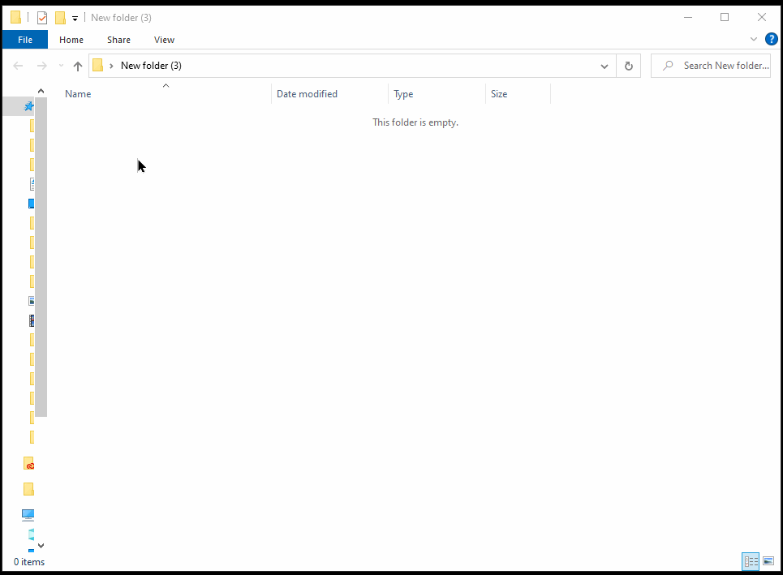

# Windows 10 New File Menu Enhancements with web dev file types

This repository provides a simple yet powerful utility to web developers. A pack of registry scripts to enhance the Windows 10 context menu when right-clicking in File Explorer. The script adds options to create new PHP, HTML, CSS, and JS files directly from the context menu.

## Install

1. Clone or download this repository to your local machine.

2. Double-click to run the registry file for the file type you want to add to the context menu. Alternatively, you can run the _install-all.reg_ file to add all file types at once.

## Uninstall

1. Navigate to where you downloaded the repository.

2. Double-click to run the registry file for the file type you want to remove from the context menu. Alternatively, you can run the _uninstall-all.reg_ file to remove all file types at once.